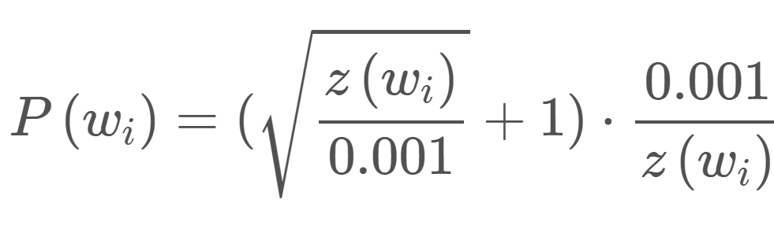
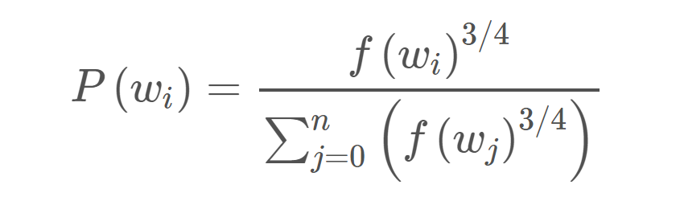

# Semantics of Mental Lexicon Development in Children

## Lexical Semantic Change

Lexical Semantic Change refers to how the meaning of a word changes over time.

Change in meaning include change in core meaning(gay - from happy to homosexual)and change in cultural association(Iraq/Syria - associated with war). 

Various types of semantic shifts, narrowing-broadening (specific meaning to wider meaning) or positive-negative spectrum. 
Semantic shifts can be classified into two major categories, linguistic shift(core meaning) and cultural shift(cultural association). Semantic shifts are reflected in large corpora by a change in reference of use of the word as shown by co-occuring words.

Rate of semantic change is vastly different for different words. Polysmey affects lexical access speed and second language learning. Polysemy related to word frequency, higher the frequency, more the senses.

## Diachronic Word Embeddings

Word Embedding refers to the mapping of words in corpora to vectors. It is a practice in NLP because models deal well with numeric data only. Diachronic word embeddings refers to vectors of words over a period of time. As the meaning and context of the word changes, it's vector changes accordingly

***PPMI***(Positive Pointwise Mutual Information), ***SVD***(Singular Value Decomposition) and ***SGNS***(Skip-Gram Negative Sampling) are algorithms used for embedding.

### Skip-Gram Negative Sampling

A neural network is trained on a "fake" task by training it on word pairs within a specific window from the corpus. The weights from the hidden layer are used to find the vector of each word. The rows of the weight matrix are the word vectors.

If the number of words in the corpus are very large then the weight matrix becomes incessantly bulky. Running a gradient descent on a NN that large would be very slow, and overfitting would also be a problem.

To deal with this SGNS using ***subsampling*** of frequent words with the help of a defined sampled rate that decreases with the frequency of the word.

***<i>w</i>i*** is the word, ***<i>z</i>(wi)*** is the fraction of the total words in the corpus that are that word. ***<i>P</i>(<i>w</i>i)*** is the probability of ***keeping*** the word. There is also a parameter in the code named ‘sample’ which controls how much subsampling occurs, and the default value is 0.001:

So as the frequency of the word increases, the probability of it being samples decreases drastically.

The second technique that SGNS uses is ***Negative Sampling***. In this, the training sample only modifies a small percent of weights, rather than all of them. The output is a one-hot vector with a 1 corresponding to the word and 0 for the rest. So here only a small number of ___negative samples___ are chosen to update weights for (a negatvie sample is any word for which the output is supposed to be 0). The negative samples are chosen using a unigram distribution with more frequent words, more likely to be selected.

The probability for picking the word X would be equal to the number of times X appears in the corpus, divided by the total number of words in the corpus.

This equation has the tendency to increase the probability for less frequent words and decrease the probability for more frequent words.

### Alignment Problem

When comparing the word vectors of the same word across different corpora slices containing usage in different time periods a problem arises. The word vector generation algorithm does not generate the vectors of each slice in the same vector space. To fix that, alignment of the vectors is required.

## References

1. William L. Hamilton, Jure Leskovec, Dan Jurafsky. ***Diachronic Word Embeddings Reveal Statistical Laws of Semantic Change***.  [ACL 2016](  https://www.aclweb.org/anthology/P16-1141)

2. Andrey Kutuzov, Lilja Øvrelid, Terrence Szymanski, Erik Velldal. ***Diachronic word embeddings and semantic shifts: a survey***.  [ACL 2018](https://www.aclweb.org/anthology/C18-1117)

3. Andrey Kutuzov, Lilja Øvrelid, Terrence Szymanski, Erik Velldal. ***Diachronic word embeddings and semantic shifts: a survey***.  [ACL 2018](https://www.aclweb.org/anthology/C18-1117)

