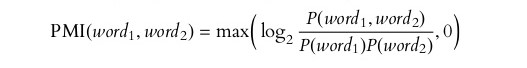
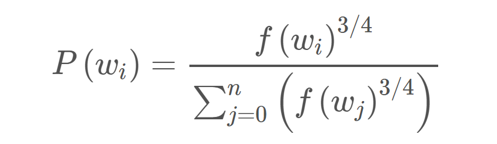
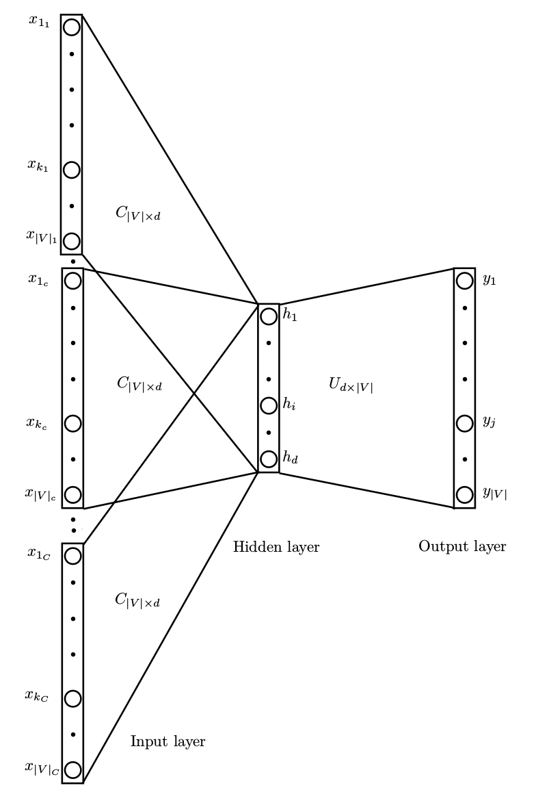
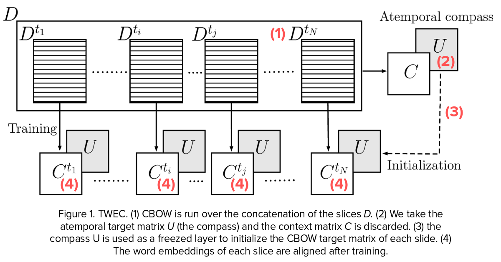

# Semantics of Mental Lexicon Development in Children

## Lexical Semantic Change

Lexical Semantic Change refers to how the meaning of a word changes over time.

Change in meaning include change in core meaning(gay - from happy to homosexual)and change in cultural association(Iraq/Syria - associated with war). 

Various types of semantic shifts, narrowing-broadening (specific meaning to wider meaning) or positive-negative spectrum. 
Semantic shifts can be classified into two major categories, linguistic shift(core meaning) and cultural shift(cultural association). Semantic shifts are reflected in large corpora by a change in reference of use of the word as shown by co-occuring words.

In general, corpora with smaller time spans are useful for analyzing socio-cultural semantic shifts, while corpora with longer spans are necessary for the study of linguistically motivated semantic shifts.

Rate of semantic change is vastly different for different words. Polysmey affects lexical access speed and second language learning. Polysemy related to word frequency, higher the frequency, more the senses.

The driving forces of semantic shifts are varied, but include linguistic, psychological, sociocultural
or cultural/encyclopedic causes. 

### Laws of Semantic Change:

1. **Law of Parallel Change:** Word vectors can be expressed as linear combinations of their neighbors in previous time periods; 
The law of parallel change proposes that words with related meanings tend to change in similar ways over time. One plausible explanation for parallel change is that language users tend to preserve associations between closely related words, which means that a word that changes in meaning is likely to “drag along” other related words
 
2. **Law of Differentiation:** The meaning of words tend to decay linearly in time, in terms of the similarity of a word to itself; 
The law of differentiation proposes that near-synonyms tend to diverge in meaning over time. For example in the Google Ngram corpus, “fragile” and “frail” were neighbors in semantic space during the 1890s but moved apart by the 1990s.

3. **Law of Conformity:** Frequent words change more slowly; 
The Law suggests that rates of semantic change scale with a negative power of word frequency. This means that higher frequency words have lower rates of change. This is because the logarithm of a word’s frequency, ***log(f(wi))***, has a significant and substantial negative effect on rates of semantic change in all settings. Given the use of log-transforms in preprocessing the data, this implies that rates of semantic change are proportional to a negative power of frequency.

4. **Law of Innovation:** Polysemous words (controlled for frequency) change more quickly; 
Words that occur in many distinct, unrelated contexts will tend to be highly polysemous. A word’s contextual diversity, and thus polysemy, can be measured by examining its neighborhood in an empirical co-occurrence network. Co-occurence networks can be build using a PPMI measure.

## Diachronic Word Embeddings

Word Embedding refers to the mapping of words in corpora to vectors. It is a practice in NLP because models deal well with numeric data only. Diachronic word embeddings refers to vectors of words over a period of time. As the meaning and context of the word changes, it's vector changes accordingly

***PPMI***(Positive Pointwise Mutual Information), ***SVD***(Singular Value Decomposition) and ***SGNS***(Skip-Gram Negative Sampling) are algorithms used for embedding.

Ideally, diachronic approaches should be evaluated on human-annotated lists of semantically shifted words (ranked by the degree of the shift). They are compared with the correct annotations using scoring such as Spearman's rank correlation coefficient.

### Skip-Gram Negative Sampling

A neural network is trained on a "fake" task by training it on word pairs within a specific window from the corpus. The weights from the hidden layer are used to find the vector of each word. The rows of the weight matrix are the word vectors.

If the number of words in the corpus are very large then the weight matrix becomes incessantly bulky. Running a gradient descent on a NN that large would be very slow, and overfitting would also be a problem.

To deal with this SGNS using ***subsampling*** of frequent words with the help of a defined sampled rate that decreases with the frequency of the word.

***<i>w</i>i*** is the word, ***<i>z</i>(wi)*** is the fraction of the total words in the corpus that are that word. ***<i>P</i>(<i>w</i>i)*** is the probability of ***keeping*** the word. There is also a parameter in the code named ‘sample’ which controls how much subsampling occurs, and the default value is 0.001:

So as the frequency of the word increases, the probability of it being samples decreases drastically.

The second technique that SGNS uses is ***Negative Sampling***. In this, the training sample only modifies a small percent of weights, rather than all of them. The output is a one-hot vector with a 1 corresponding to the word and 0 for the rest. So here only a small number of ___negative samples___ are chosen to update weights for (a negatvie sample is any word for which the output is supposed to be 0). The negative samples are chosen using a unigram distribution with more frequent words, more likely to be selected.

The probability for picking the word X would be equal to the number of times X appears in the corpus, divided by the total number of words in the corpus.

This equation has the tendency to increase the probability for less frequent words and decrease the probability for more frequent words.

### Alignment Problem

It is rather straightforward to train separate word embedding models using time-specific corpora containing texts from several different time periods. As a consequence, these models are also time-specific. However, it is not that straightforward to compare word vectors across different models. To fix that, alignment of the vectors is required.

It usually does not make sense to, for example, directly calculate cosine similarities between embeddings of one and the same word in two different models. The reason is that most modern word embedding algorithms are inherently stochastic and the resulting embedding sets are invariant under rotation. It means that even if word meaning is completely stable, the direct cosine similarity between its vectors from different time periods can still be quite low, simply because the random initializations of the two models were different.

One such method of doing this is by temporal alignment using a compass. This method is defined over ***CBOW(Continous Bag of Words)*** and ***SGNS***. In this process basically:

1. Given N slices of temporal specific text (e.g., text from 1991, text from 2000, …) we concatenate all the text and run the CBOW model on the entire D corpus.

2. We extract the second (U) matrix of the CBOW network.

3. For each slice of text Dt we run CBOW again but we initialize the second matrix of the slice-specific CBOW with the matrix from step

4. We freeze this matrix and thus stop updating those weights. At the end of each (separate) training, our embeddings are aligned with respect to the reference representation given by the compass.

Other proposed methods include the idea of aligning diachronic word embedding models using a distance-preserving projection technique was proposed by Zhang et al. (2015). Later, Zhang et al. (2016) expanded on this by adding the so called ‘local anchors’: that is, they used both linear projections for the whole models and small sets of nearest neighbors for mapping the query words to their correct temporal counterparts. Bamler and Mandt (2017) (‘dynamic skip-gram’ model) and Yao et al. (2018) (‘dynamic Word2Vec’ model) who showed that it is possible to learn the word embeddings across several time periods jointly, enforcing alignment across all of them simultaneously, and positioning all the models in the same vector space in one step.

## References

1. William L. Hamilton, Jure Leskovec, Dan Jurafsky. ***Diachronic Word Embeddings Reveal Statistical Laws of Semantic Change***.  [ACL 2016](  https://www.aclweb.org/anthology/P16-1141)

2. Andrey Kutuzov, Lilja Øvrelid, Terrence Szymanski, Erik Velldal. ***Diachronic word embeddings and semantic shifts: a survey***.  [ACL 2018](https://www.aclweb.org/anthology/C18-1117)

3. Yang Xu, Charles Kemp. ***A Computational Evaluation of Two Laws of Semantic Change***.  [CogSci 2015](https://lclab.berkeley.edu/papers/xu_kemp_2015_parallelchange.pdf)

4. Valerio Di Carlo, Federico Bianchi, Matteo Palmonari. ***Training Temporal Word Embeddings with a Compass***.  [AAAI 19](https://doi.org/10.1609/aaai.v33i01.33016326)
