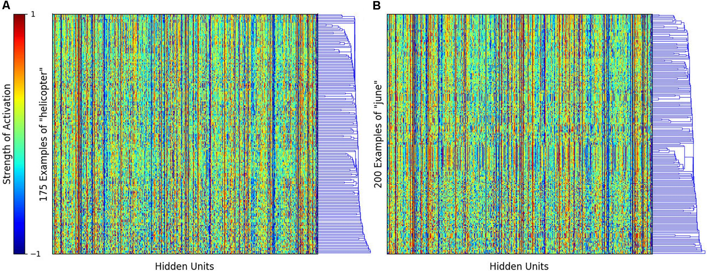

# Structured Semantic Knowledge Can Emerge Automatically from Predicting Word Sequences in Child-Directed Speech
*Philip A. Huebner and Jon A. Willits*

***[Paper](https://doi.org/10.3389/fpsyg.2018.00133)***

## Introduction
The paper aims to prove that distributional learning mechanisms, statistical learning and deep learning approaches in acquisition of semantic knowledge are able to learn abstract and structured knowledge, even from a noisy dataset. 
1. **Models**: The 3 models used in this are a SRN(Simple Recurrent Network), an LSTM(Long Short Term Memory) and a non recurrent model, the Skip-gram Negative Sampling(Word2Vec).

 <i>Models<b> ; A</b> is the SRN<b> , B</b> is a single unit of the LSTM and <b>C</b> is the SGNS</i>

2. **Corpus**: The models are trained on child directed speech extracted from the [CHILDES](https://childes.talkbank.org/) corpora. They use all transcripts involving typically-developing children 0–3 years of age from American–English-speaking households. This results in a corpus containing 2873 documents, 22,448 word types, and 5,308,679 word tokens, collected from 52 different studies of parent–child interactions. They randomly split the documents into separate training (5,244,672 word tokens) and testing (64,007 word tokens) corpora, where the former will be used for training, and the latter will be used to assess generalization to input not encountered during training. 

## Training
The vocabulary of 5,308,679 words is reduced down to the 4096 most frequent words as it is assumed that children are unlikely to know the lexical form of lower frequency words. A total of 720 words are chosen as probe words and are divided into 29 categories based on their thematic and taxonomical relationships. All tests of model performance are performed on these 720 probe words.

 <i>Categories</i>

For the training of the recurrent neural network, contrary to conventional neural network training procedure in which the input sequences are presented to the model from multiple iterations over the whole corpus, their models iterate over small partitions of the age-ordered corpus. For the corpus conatining speech data for children of ages 1-3, a typical neural training procedure that iterates over the input five times would have the partitions presented to the model in the order: 1,2,3,1,2,3,1,2,3,1,2,3 whereas, they present the partitions in the order 1,1,1,1,2,2,2,2,3,3,3,3. This effecive simulates a more realistic scenario where a child develops semantic connections between words in the duration of an hour, day or week as compared to months or years. Also, as the models are sensitive to changes of the structure over time, this method allows better simulation of development trends and trajectories. Also, the corpus is divided into 256 approximately equal parts and 10 of each of the recurrent models are trained on the whole corpus.  
The SGNS model is included to compare the representations generated by the recurrent networks to the state-of-the-art model in machine learning. While the SGNS has various optimizations like sub sampling and negative sampling to increase it's performance, these also decrease it's plausability as a realistic cognitive model. Also, because the SGNS is not explicitly trained to learn word order *(when SGNS predicts a word, it is not told what distance it was located away from the input word; however, it is trained more frequently on those that occur more closely)* , insight can be gained into, how and to what degree, information about word order during training influences learning of semantic structure.

## Testing
A number of tests are conducted on all the models to judge their ability to learn structural and semantic relations in the data. As the SRN is the simplest and most plausible network, all results are with repsect to the SRN. The other models are mentioned only if their results vary greatly.
1. **Sequential Structure Prediction :** This test is to assess the models ability to learn the structures of sequences in the data that it trained upon. It is done by making the model predict the next possible word prediction to an input sequence, and then the perplexity score is calculated. At the end of training, the mean per-word perplexity score of the 10 SRNs was 43.8 ± 0.05 (M ± SEM), and that of the 10 LSTMs was 42.6 ± 0.01 (M ± SEM). Compared to the same score before training (4102.2 ± 2.4 for SRN, 4095.9 ± 0.6 for LSTM), this is a significant reduction, and strong evidence that learning of word sequences has taken place. Because Skip-gram cannot predict word sequences there is no way to directly compare Skip-gram on this measure.

2. **Encoding of Abstract Semantic Features :** For this, the internal representations of words in the SRN were investigated. The representation, or word vectors for any word in these models is given by their hidden layer activation. In recurrent models, the hidden layer activation is different for each occurence of the same word because of the influence of prior context. On comparing the representations of 2 words *helicopter* and *june* it is found that the polysemic nature of the word *june* is clearly represented by the model by some clusters of rows that are different from the rest, whereas in *helicopter* they are consistently similar.

 <i>Encodings</i>

In order to get single word representation for further tests, the corpus was passed through each recurrent model after training, and the hidden layer activation after each sequence was recorded. For the representation of a single word, all the activations corresponding to sequences ending with the requried word were averaged. In SGNS, the word representation was simply the corresponsing row in the models inpur hidden weights layer.

3. **Similiarity between Models :** To see the extent to which each models 10 runs generated representations similar to each other, the matrix of similarity scores for each run is taken and correlated to each other to get a r score for each pairwise similarity in semantic space. These analyses showed that the different instances of the SRN were most similar to one another, (r = 0.967 ± 0.0002, mean ± standard error), that the LSTM instances were less similar (r = 0.959 ± 0.002), and that the different instances of Skip-gram were the least similar to one another (r = 0.889 ± 0.0005).

4. **Nearest Neighbour :**
