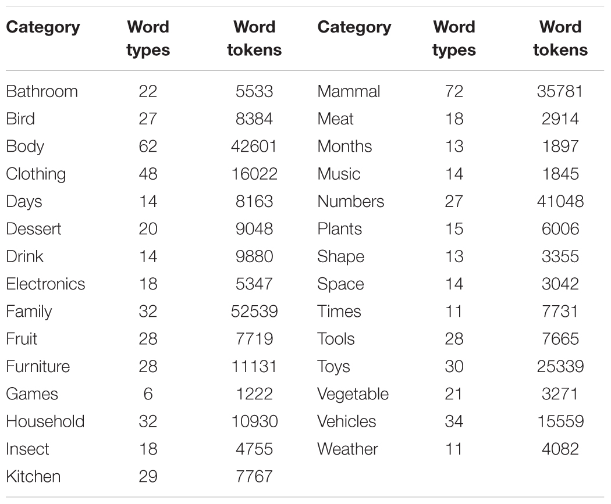

# Structured Semantic Knowledge Can Emerge Automatically from Predicting Word Sequences in Child-Directed Speech

***[Paper](https://doi.org/10.3389/fpsyg.2018.00133)***

## Introduction
The paper aims to prove that distributional learning mechanisms, statistical learning and deep learning approaches in acquisition of semantic knowledge are able to learn abstract and structured knowledge, even from a noisy dataset. 
1. **Models**: The 3 models used in this are a SRN(Simple Recurrent Network), LSTM(Long Short Term Memory) and a non recurrent model, the Skip-gram Negative Sampling(Word2Vec). 
2. **Corpus**: The models are trained on child directed speech extracted from the [CHILDES](https://childes.talkbank.org/) corpora. They use all transcripts involving typically-developing children 0–3 years of age from American–English-speaking households. This results in a corpus containing 2873 documents, 22,448 word types, and 5,308,679 word tokens, collected from 52 different studies of parent–child interactions. We randomly split the documents into separate training (5,244,672 word tokens) and testing (64,007 word tokens) corpora, where the former will be used for training, and the latter will be used to assess generalization to input not encountered during training. 

## Training
The vocabulary of 5,308,679 words is reduced down to the 4096 most frequent words as it is assumed that children are unlikely to know the lexical form of lower frequency words. A total of 720 words are chosen as probe words and are divided into 29 categories based on their thematic and taxonomical relationships. All tests of model performance are performed on these 720 probe words.

 <i>Categories</i>

