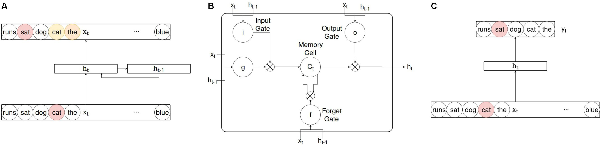

# Structured Semantic Knowledge Can Emerge Automatically from Predicting Word Sequences in Child-Directed Speech

***[Paper](https://doi.org/10.3389/fpsyg.2018.00133)***

## Introduction
The paper aims to prove that distributional learning mechanisms, statistical learning and deep learning approaches in acquisition of semantic knowledge are able to learn abstract and structured knowledge, even from a noisy dataset. 
1. **Models**: The 3 models used in this are a SRN(Simple Recurrent Network), LSTM(Long Short Term Memory) and a non recurrent model, the Skip-gram Negative Sampling(Word2Vec).

 <i>Models<b> ; A</b> is the SRN<b> , B</b> is the LSTM and <b>C</b> is the SGNS</i>

2. **Corpus**: The models are trained on child directed speech extracted from the [CHILDES](https://childes.talkbank.org/) corpora. They use all transcripts involving typically-developing children 0–3 years of age from American–English-speaking households. This results in a corpus containing 2873 documents, 22,448 word types, and 5,308,679 word tokens, collected from 52 different studies of parent–child interactions. They randomly split the documents into separate training (5,244,672 word tokens) and testing (64,007 word tokens) corpora, where the former will be used for training, and the latter will be used to assess generalization to input not encountered during training. 

## Training
The vocabulary of 5,308,679 words is reduced down to the 4096 most frequent words as it is assumed that children are unlikely to know the lexical form of lower frequency words. A total of 720 words are chosen as probe words and are divided into 29 categories based on their thematic and taxonomical relationships. All tests of model performance are performed on these 720 probe words.

 <i>Categories</i>

For the training of the recurrent neural network, contrary to conventional neural network training procedure in which the input sequences are presented to the model from multiple iterations over the whole corpus, their models iterate over small partitions of the age-ordered corpus. For the corpus conatining speech data for children of ages 1-3, a typical neural training procedure that iterates over the input five times would have the partitions presented to the model in the order: 1,2,3,1,2,3,1,2,3,1,2,3 whereas, they present the partitions in the order 1,1,1,1,2,2,2,2,3,3,3,3. This effecive simulates a more realistic scenario where a child develops semantic connections between words in the duration of an hour, day or week as compared to months or years. Also, as the models are sensitive to changes of the structure over time, this method allows better simulation of development trends and trajectories.  
The SGNS model is included to compare the representations generated by the recurrent networks to the state-of-the-art model in machine learning. While the SGNS has various optimizations like sub sampling and negative sampling to increase it's performance, these also decrease it's plausability as a realistic cognitive model. Also, because the SGNS is not explicitly trained to learn word order *(when SGNS predicts a word, it is not told what distance it was located away from the input word; however, it is trained more frequently on those that occur more closely)* , insight can be gained into, how and to what degree, information about word order during training influences learning of semantic structure.

## Testing
