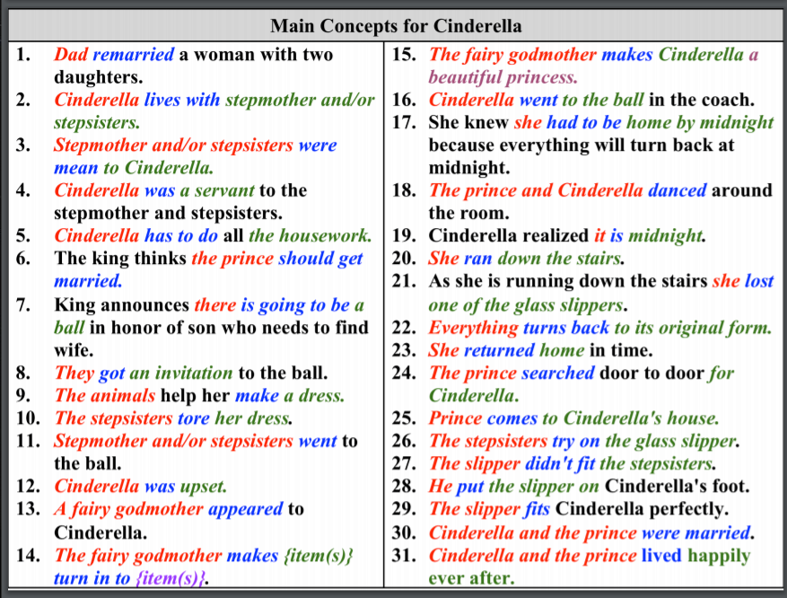
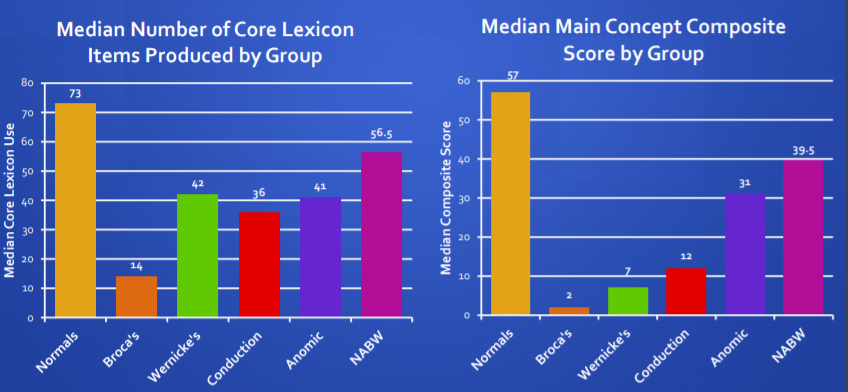

# AphasiaBank: Methods for Studying Discourse

### Overview

- Aphasia is a language disorder due to brain damage that affects the ability of a person to comprehend speech and their ability to speak, read and write. AphasiaBank is an accumulation of spoken data by persons with aphasias (PWAs) to study the language used by them.  

- It contains standardized discourse from 290 persons with aphasia and 190 control participants from all over the world. The paper describes the various of method of studying discourse in aphasia and it's analyses. 

  

### Methods

The AphasiaBank protocol (along with standardized tests such as Western Aphasia Battery-revised (WAB-R)  Aphasia Quotient subsets, the Boston Naming Test (BNT) & Verb Naming Test) and  has 4 discourse tasks:

- Personal Narratives - describe personal experiences
- Picture Descriptions - describe black and white drawings
- Story Telling - a retelling of the story Cinderella
- Procedural Discourse - describe a recipe 

The interviews with PWAs are transcribed and checked. Once the transcription is complete, it goes through analysis with Morphological Tagging (analysis of words and identifying their form). 

##### Illustrative Analysis

In storytelling analysis, the interviewee is asked to complete the story of Cinderella. The following conclusions are made from the task:

- In total, controls produced twice as many total and varied words compared to the PWAs.
- PWA's have a reduced lexical diversity. Frequency usage of specific words like carriage, midnight and glass rank low on the frequency list compared to controls. (Lexical diversity is usually measured using TTR however it is highly sensitive to sample size and varies very quickly.)
- PWAs produce half the number of nouns and verbs. 
- Morphosyntactic Analysis reveals that PWA samples have a very low count of reflexive pronouns, possessive pronouns, prepositions, modals, and infinitives as well as superlative, regular 3rd person singular, and regular past tense.
- PWAs barely used collocations like “Once upon a time" - which didn't even appear once - and "Happily ever after". 
- Results reveal that the word *Cinderella* (and *Cinderella’s)* was produced by the PWAs 349 times and 23% of those were not correct. The error analysis considers phonological errors and neologisms. 
- Gesture Analysis suggests that PWAs use it to compensate for verbal shortcomings.

### Analyzing Discourse

- Some of the measures currently used to study discourse are CIU, TTR, MC, Story Grammar Analysis etc. Most of these however require extensive training and are limited in scope. An alternative measure of discourse ability is core lexicon. 
- MacWhinney suggested that comparing PWAs noun and verb lexicon during narrative tasks to a created core lexicon would be a time-efficient and informative assessment method. 
- The core lexicon is determined by the words most frequently spoken and considered necessary for the storytelling. 

##### Core Lexicon Method:

1. Using GEM command (CLAN), extracting the Cinderella story segments from the rest of the transcript.

2. Core Lexicon from the transcripts of controls (uttered by more than 50% speakers) is compiled

3. Using this above list, the Cinderella gems were scored a 1 if the word in the Core Lexicon was present in their gem, and 0 if not.

   

   ##### Main Concept Method:

   1. A list of all relevant concepts with 50% or more usage became main concepts and is compiled.

   2. The transcript were scored according to the MC list with a grading from 0-3 where 0 = absent and 3= Accurate/Complete.

      

The two methods are compared using medians and Spearman correlation between controls and PWAs.

## Results and Conclusion

- All the aphasia subtypes are significantly different from people without aphasia for both Main Concept and Core Lexicon (p<0.01).
- Spearman's correlations show a positive corelation between the two methods (rs = 0.890, p<0.01). 
- The paper "AphasiaBank as BigData" by Brian MacWhinney and Davida Fromm review results from 45 studies based on these data that investigate aphasic productions in terms of these eight areas: discourse, grammar, lexicon, gesture, fluency, syndrome classification, social factors, and treatment effects.
