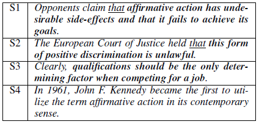
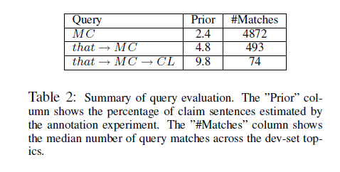

# Unsupervised corpus-wide claim detection

##### by Ran Levy, Shai Gretz, Benjamin Sznajder, Shay Hummel, Ranit Aharonov - IBM Research

#### Overview

1. This paper aims to automatically mine claims on the topic of consideration using claim sentence query. 
2. Claim is the assertion an argument makes and proves. 
3. This paper follows different approach from previous work as it :
   - doesn't assume the availability of articles enriched with relevant claims
   - doesn't focus on the analysis of a small set of arguments

4. This uses two principles
   - claims are semantically related to the topic
   - sentences contain claims have a common structure

#### Identifying claim

The *Main Concept (MC)* may or may not be explicitly mentioned in the sentence.

1. To identify semantic relatedness, a Wikification tool is used. This has two advantages:
   - identifies the MC mentioned using a different surface form. *(S3)*
   - prevents drift in the meaning of topic 
2. The token 'that' often precedes the claim and is used as weak label. *(S1, S2)*
3. Further identify unigrams that follow the token 'that' and the MC. This gives a *Claim Lexicon (CL)*.
4. This forms the Claim Sentence Query (CSQ): *that*->MC->CL

Debate topics that focus on a single concept are chosen and that have at least 1000 matches for the query *q1* = *MC*. Then 100 topics that satisfy the above query are randomly selected as a development set (dev-set) and 50 topics are chosen as a test set. 

#### Claim Sentence Query (CSQ)

1. Divide q1-set into two sets - *c1* and *c2*. *c1* contains the token *that* before MC.  Class c1 consists of 183*K* sentences with *P(c1)* = 0.0986.

2. This is followed by standard pre-processing like tokenization, stop-word removal, lower-casing, pos-tagging using OpenNLP. 

3. Formally defining n1 as the number of sentences in c1 that contain w in the sentence suffix; n2 as the number of sentences in c2 that contain w;
   
         Psuff (c1|w) = n1/(n1 + n2).
   
   Claim Lexicon is the set of words that satisfies
  
         Psuff (c1|w) > P(c1)
   

  4. CL should contain words that are indicative of claims in a general sense. Nouns, single-character-token, county-specific terms are excluded. This results in a lexicon of 586 words.

    
   

  5. Using this, corpus-wide claim detection can be performed by adding sentence re-ranking, boundary detection and simple filters. Sentences are ranking by the average of two scores

       - w2v: compares the word2vec representation of each word following *that* to find the best cosine match and the average of the scores
       - slop: number of tokens between *that* and the CL. The closer the two elements are, the higher the probability that it contains a claim. 

  6. To evaluate the performance, crowd labelling is applied on the predicted claims for the 150 topics in the dev and test set. For each topic, at most top 50 predictions were labelled and the prediction is considered correct if majority annotators marked it as a claim.

#### Conclusion

This unsupervised approach outperforms previous work that used a supervised approach over a manually pre-selected set of articles. 

The test results are better for the test set compared to dev set suggesting it can generalize new topics as well. The precision increases for topics which have an increased number of sentences matching the CSQ.

Limitation: Not suitable for complex topics or topics not supported by Wikipedia. Focuses only on the patter *that*->MC

  
