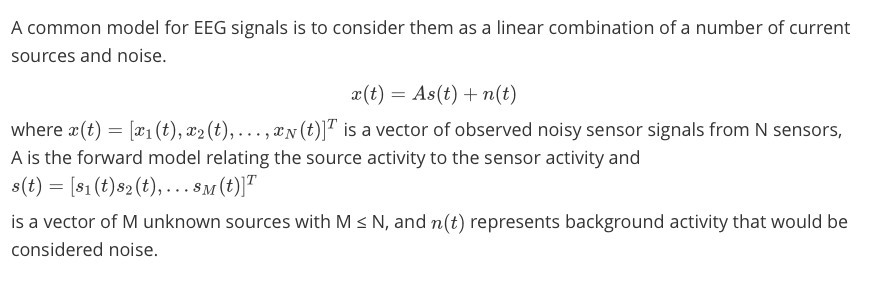
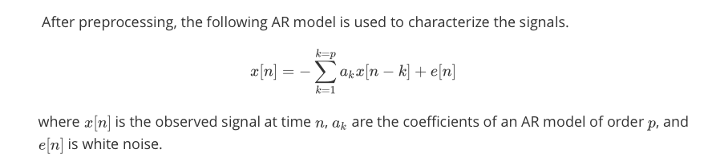
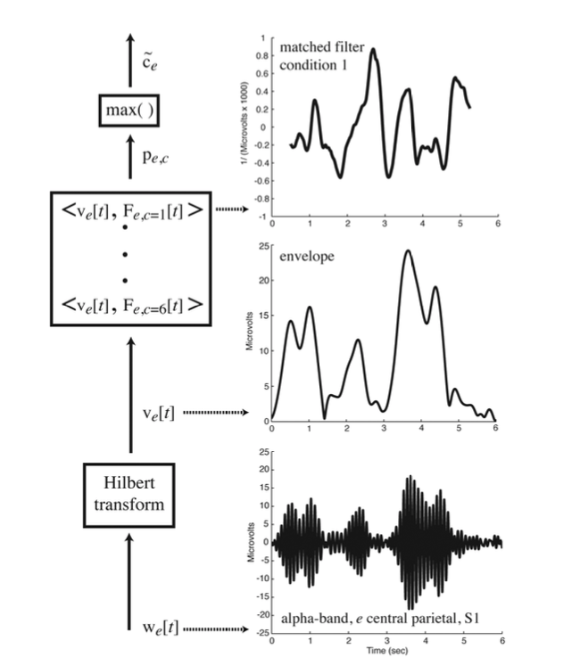
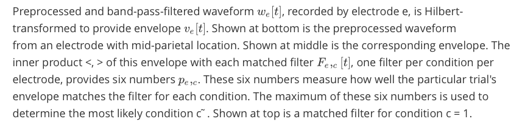

# EEG Sensing Of Imagined Speech

------

## INTRODUCTION

------

Imagined speech (silent speech or covert speech or inner speech ) is thinking in the form of sound – “hearing” one's own voice silently to oneself, without the intentional movement of any extremities such as the lips, tongue, or hands[[2]](https://en.wikipedia.org/wiki/Imagined_speech).The capability to translate this imagined speech has the clear potential for a variety of uses, specially it may help the people who are unable to talk. 

EEG is a technique to measure the electric fields produced by brain activity. From EEG measurements, it may be possible to extract information and decipher this internal thoughts. Analysis of EEG data from an experiment in which two syllables are spoken in imagination in one of three rhythms shows that information is present in EEG alpha, beta and theta bands[[1]](https://link.springer.com/chapter/10.1007/978-3-642-02574-7_5). 

## CHALLENGES IN EEG SIGNAL CLASSIFICATION

------

- Low signal-to-noise ratio.
- Presence of artifacts such as signal spikes caused by eye blinks and electromyographic (i.e., muscle) activity, which can dominate and obscure the actual cortical signal.
- Inter-subject variation.
- Intra-subject variation.

## DATA PREPROCESSING

------

1. #### **Modeling EEG Signals**

   
   
   
   
2. #### **Independent Component Analysis with EEG Data** 

   To estimate the matrix A, Independent Component Analysis (ICA) is used so that we can find sources that are statistically independent. ICA components, might represent activity in a spatially broadly distributed set of cortical domains, if their activities were somehow synchronized.

   It is assumed that different biological processes operate independently, so therefore ICA could be used to separate out components that are generated from different biological sources. With this, one may attempt to remove artifacts from the EEG data by identifying and discarding sources that appear to have been generated by extraneous movement-related activity.

   

3. #### **Artifact Removal**

   1. EEG signals that are closest to the neck, eyes, and temple are discarded since they are the most prone to EMG artifacts.

   2. A certain number of trials (depending on the subject) that contain a large number of electrodes exceeding the thresholds of +/- 30μV are discarded since they are most likely heavily contaminated by the artifacts.

   3. Since EMG artifacts are typically present in frequencies greater than 25Hz, the remaining EEG signals are filtered to a frequency range of 4 – 25Hz.

   4. Hurst Exponent:- A method to automate artifact removal by using the Hurst exponent to identify components that contain artifacts. The Hurst exponent, which measures the predictability of a time series, is a metric that ranges from 0 to 1. Hurst exponent of sources containing heartbeat and eye blink artifacts appear to fall within the range of 0.58 – 0.69. Therefore, by discarding independent components that have Hurst exponent values within this range, one may remove the effects of these artifacts on the EEG data. Components that have Hurst exponent values outside the range of 0.70 – 0.76 are discarded as well.

      

4. #### **Subspace Filtering**

   EEG signals are filtered with a subspace-based Wiener filter for further noise reduction. Due to the typically sparse structure of EEG signals, a low-rank filter can be built in place of a full- rank filter.

   If a filter were designed using the whole signal, the filter would likely describe both the signal and the noise structure. By applying Principal Component Analysis (PCA), the signal and noise subspace can be partially separated.

## TWO APPROACHES TO CLASSIFY THE EEG SIGNALS

------

### APPROACH 1:

#### 	1. **Univariate Autoregressive (AR) Model**

####     2. Imagined Syllable Classification

​	  	 Classification of the imagined syllables was performed using a K-Nearest Neighbours classifier 		 		   based on the Euclidean distance between AR model coefficients in the training and testing set. 

​       	Each electrode’s AR coefficients in the testing set were compared with only the same electrode’s AR  		   coefficients in the training set, and the mode of the predicted class labels from each electrode 		  		   classification was taken across all possible class labels to obtain the final prediction.

### APPROACH 2:

​	EEG waveform envelopes are used to classify trials according to experimental condition.

​	These envelopes were computed for each electrode in the theta (3-8Hz), alpha (8- 13Hz) and beta (13-	18Hz) frequency bands and used to construct matched filterS, one for each of the six conditions.The 	  	inner product of each matched filter with a particular trial's envelope provides six numbers. The 			       	matched filter which gives rise to the largest inner product is the best match, and the condition to 	   	which the matched filter corresponds is declared the best guess as to the experimental condition for 	that trial.

​	

## RESULTS 

------

### APPROACH 1: 

​	This experiment was conducted on 7 subjects[[3]](https://link.springer.com/chapter/10.1007/978-3-642-02574-7_5) with 

​    1. Average Classification Rate:- 0.61

​	2. Minimum Classification Rate:- 0.46

​	3. Maximum Classification Rate:- 0.88

### APPROACH 2:

​	This experiment was conducted on 4 subjects[[1]](https://link.springer.com/chapter/10.1007/978-3-642-02574-7_5)

| Subject | alpha | Beta | Theta |
| :-----: | :---: | :--: | :---: |
|   S1    | 0.38  | 0.80 | 0.63  |
|   S2    | 0.63  | 0.87 | 0.59  |
|   S3    | 0.44  | 0.68 | 0.46  |
|   S4    | 0.64  | 0.62 | 0.59  |

## References

------

1. https://link.springer.com/chapter/10.1007/978-3-642-02574-7_5
2. https://en.wikipedia.org/wiki/Imagined_speech
3. https://link.springer.com/chapter/10.1007/978-3-642-02574-7_5

