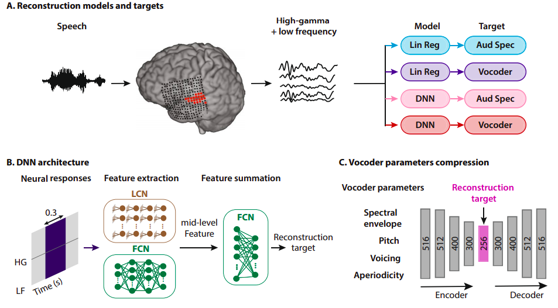
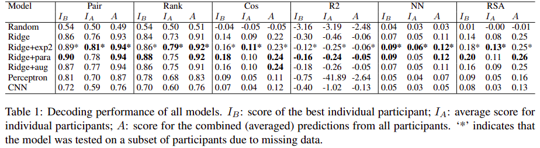

# Problem of Interest

*  Models for predicting distributional word meaning representations from
brain imaging data

* Desired output of the model is a word embedding that could be useful in downstream tasks, possibly a brain2text encoder-decoder. 

* Obtaining decent accuracy for predicting distributional representations could facilitate the development of
a ‘mind reading’ device with numerous practical applications such as an aid for patients with dusfunctions.

*  Providing insights about how much of the textual co-occurrence information that distributional models are based on
is present in the brain

# Experiments on Subjects (For data collection)

* Stimulus words presented to participants and their brain activity recorded

* Stimulus words presented in three different ways - the written word plus an image representing the word, the
word in a word cloud, and the word in a sentence

* fMRI images of 180 different content words collected for 16 participants. 

<b>Note</b> - Data for different participants cannot be directly combined due to differences in brain organization. Decoders are always
trained for each participant individually.

# Data

* Words for the experiments selected by clustering a pre-trained GloVe space(300 dimensions) consisting of 30,000 words into regions, and then
manually selecting a word from each region to yield a set of 180 content words that include nouns, verbs, and adjectives.

* Combined representation created for each word by averaging the fMRI images from the three stimulus presentation paradigms for each participant. (Shown to be better than using individually)

# Methods

* Vector space created(from the imaging data) for every participant whose dimensions(approximately 200,000) are voxel activation values
in that participant’s brain scan.  Feature selection carried out to reduce the space to around 5000 dimensions.  

<b>Voxel:</b> 3D pixel representing the blood oxygenation level of a small part of the brain. 

## Regression

* Ridge regression model trained for mapping this fMRI brain space to the GloVe space 

* Model trained to predicts each of the 300 GloVe dimensions separately. Intuition being that variation in each dimension of semantic
space corresponds to specific brain activation patterns.

<b>Ridge regression:</b> Weight regularized linear regression model. Particularly useful for high dimensional data with a high
degree of correlation between many of the input variables.

## Perceptron

*  MLP with a flattened representationof the 5000 ‘best’(from feature selection) voxels as input

## CNNs

* Intuition that brain images, like ordinary photographs, contain strong correlations between spatially close pixels(voxels)

# Result Metrics

* <b>Pairwise Accuracy</b> 
Calculated by considering all possible pairs of words (u, v) in the vocabulary and computing the similarity(Pearson correlation) between
the predictions (pu, pv) for these words and their corresponding target word embeddings (gu,gv).  
Accuracy is then defined as the fractionof pairs where ‘the highest correlation was between a decoded vector and the corresponding
text semantic vector’.

* <b>Rank Accuracy</b> 
Calculated by computing thec orrelation, for every word in the vocabulary, between the predicted word embedding for that word
and all of the target word embeddings, and then ranking the target word embeddings accordingly. 
The accuracy score for that word is then defined as 1 − (rank − 1)/ ( |V| − 1 ),  
where rank is the rank of the correct target word embedding. This accuracy score is then averaged over
all words in the vocabulary

* <b>R2 Scores</b> 
Standard metric for evaluating regression models, particularly useful for testing how well the value of each individual dimensions is predicted (recall that dimensions were predicted separately)

* <b>Cosine Similarity</b> 
Standard metric in distributional semantics to measure how far each prediction is from ‘where it
should be'

* <b>Nearest Neighbour</b> 
For each word in the space, predicted
and target word embeddings are considered, and the ten nearest neighbours of these vectors in their respective spaces are compared.  
The final score is the mean Jaccard distance computed over all pairs of neighbour lists

* <b>Representational Similarity Analysis (RSA)</b> 
Common method in neuroscience for comparing the similarity structures of two (neural or
stimulus) representations by computing the Pearson correlation between their respective similarity matrices

# Results 

To compare individual-level and group-level predictions(over the 3 paradigms of collecting data),three different scores for each model:
the highest score for the predictions of any individual participant (IB), the average score for the
predictions of all individual participants (IA), and the score for the averaged predictions (A)

* All models beat a simple baseline model that predicts vectors of random numbers (except
on the R2 metric, where the fully connected network performs below baseline)

* Performance on the Pair and Rank scores is generally good, but performance on the
other metrics is much worse

* Cos similarity is very low and R2 scores are negative, meaning that the predicted
word embeddings are very far in semantic space from where they should be

# Issues

* Not enough training data to learn a precise mapping

* None of the tested models learns a good cross-space mapping: the predicted semantic vectors are far from their expected location and fail to capture the target space’s similarity structure

* Meanwhile, excellent performance is achieved on pairwise and rank-based classification
tasks, which implies that the predictions contain sufficient information for reconstructing stimulus
word labels

* Standard GloVe embeddings are context-independent
(i.e. a given word always has the same representation regardless of its word sense and syntactic position in the sentence), whereas the brain
images are not because they were obtained using contextualized stimuli

# References

* [Towards reconstructing intelligible speech from the human auditory cortex](https://www.nature.com/articles/s41598-018-37359-z)
* [From brain space to distributional space:the perilous journeys of fMRI decoding](https://www.aclweb.org/anthology/P19-2021.pdf)

