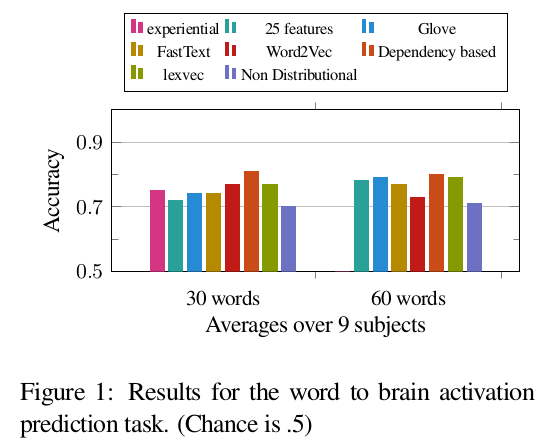
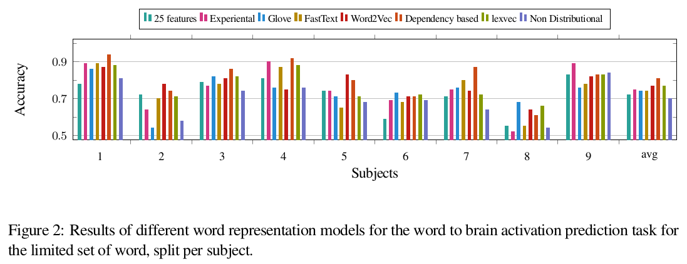
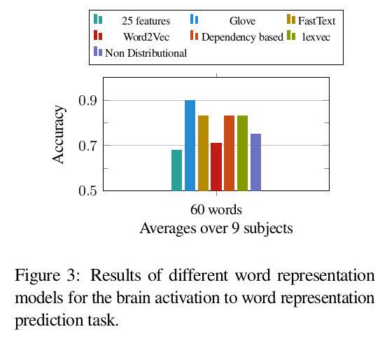
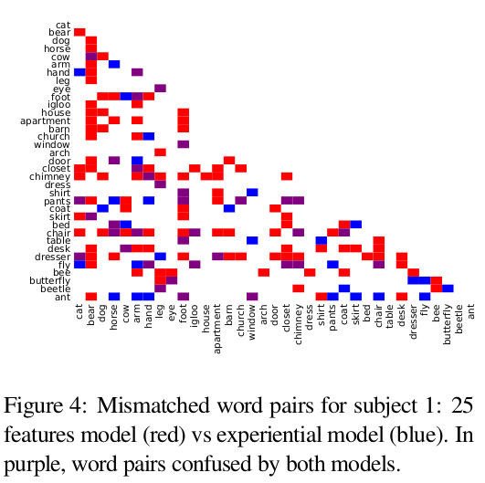
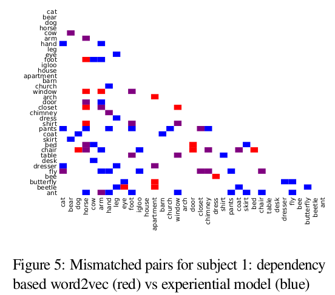
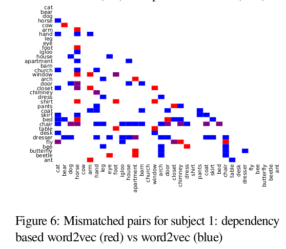
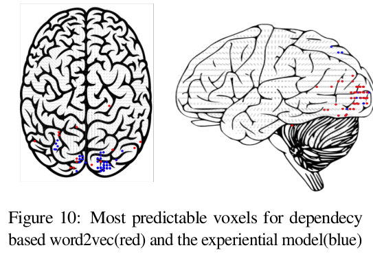
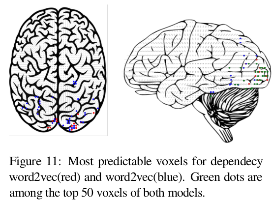

# Objective

* To evalulate the performance of word embedding models designed based on different assumptions of how meanings of words can be represented on either the task of predicting brain data from word embeddings or the reverse, predicting word embeddings from brain data

* The basic assumption is that the better the performance of a model is the more probable it is that the way the word embedding model is built reflects what happens in the human brain to understand a meaning of a word

* To investigate whether the information encoded in different kind of word representations are
mutually exclusive and hence, integrating them would result in a more powerful model

# Data

* Collection of fMRI data that is gathered from 9 participants while exposed to distinctive stimuli. The stimuli consisted of 60 nouns
and corresponding line drawings. Each stimulus was displayed six times for 3 seconds in random order,
adding to a total of 360 fMRI images per participant

[Data](http://www.cs.cmu.edu/afs/cs/project/theo-73/www/science2008/data.html)

# Models

## Mapping Model

* Single layer neural network with tanh activation, dropout and L2 regularization

## Word Embeddings Models

### Experiential word representations

 * Meanings of the words are coded to reflect how the corresponding concept is experienced by humans through their senses

* A set of features is defined and crowdsourcing is used to rate the relatedness of each feature for each word

### Distributional word embedding models

1. Word2Vec

2. Fasttext

* Modification of word2vec that takes morphological information into account

* Representations are learnt for character n-grams, and words are represented as the sum of the n-gram vectors

3. Dependency-based Word2Vec

* Word2Vec model in which the context of the words is computed based on the dependency relations

* Word2Vec takes the contexts of a word to be its linear context –
words that precede and follow the target word, typically in a window of k tokens to each side.

* Dependency-based Word2Vec incorporates syntactic contexts that are derived from automatically produced dependency parse-trees

4. GloVe

### 25 verb features

* This model is based on the idea that the neural representation of nouns is grounded in sensory-motor features. They have manually picked
25 verbs and suggested to use the co-occurrence counts of nouns with these 25 verbs to form the word representations

### Non-distributional word vector representation

* In this model, words are presented as binary vectors where each element of the vector indicates whether the repre-
sented word has or does not have a specific feature

# Evaluation

* Each trained model was evaluated by means of a “leave-two-out” cross-validation approach, in which the model was repeatedly trained
with all but 2 of the available word stimuli and associated fMRI images.

* Each trained model was tested by requiring that it first predict the fMRI images for the two “held-out” words and then match
these correctly to their corresponding held-out fMRI images.

* The match between the two predicted and the two observed fMRI images was determined by which
match had a higher cosine similarity, evaluated over the all image voxels

# Task 1: Predicting neural activation patterns using word embeddings and vice-versa

* Separate regression models are trained for each word representation model to compute the average brain activation corre-
sponding to each word for a particular subject

## Results

* Ranking of the models differs per subject makes it difficult to make general conclusions about the best model.

* Overall, dependency-based word2vec, GloVe and 25 features model are the top-ranked models for at least one of the subjects

* The fact that fasttext and dependency based word2vec are performing better than word2vec might reflect the importance of morpholog-
ical and dependency information

* In both sets of experiments, the non-distributional word representation model has the lowest performance. The very high dimensionality of
the brain imaging data versus the sparseness of non- distributional word vectors make training the regression model with these vectors much harder and this might be the primary reason for its low performance

# Task 2: Predicting word representations from brain activations

* It seems that it is very easy to construct GloVe word vectors from brain activation patterns; the model achieves an accuracy of 90 percent

* GloVe is based on the distributional semantics hypothesis, and it is achieved by learning to predict
the global co-occurrence statistics of words in a corpus.  
Hence, obtaining a high accuracy in the word prediction task using GloVe, supports the fact that the
context of the words have a major role in the way we learn the meanings of the words

* The important thing to notice is that of course as more information is encoded in the word representation, 
it becomes more powerful in predicting neural activation patterns as far as that information are relevant to some extent. 
However, this alone doesn’t imply that the exact same information is encoded in the neural activation patterns. The results show that, compared to GloVe, it’s not that easy to reconstruct the Fasttext and dependency based word vectors from the brain activation patterns. 

* What can be concluded is that while morphological and dependency information is helpful in learning word representations that are to
some extent more similar to the neural representation of nouns in our brain. This information is not
explicitly encoded in the brain activation patterns.

# Task 3: Comparing the performance of the models for different classes of nouns

* The motivation behind this task is to test the hypothesis of whether human brain uses different mechanisms for understanding meanings of
different categories of words

* To investigate this, the miss matched noun pairs for each of the word representation models are analyzed
  

  

* While there is some overlap between the mistakes of the 25 features model and the experiential model, considerable number of
mismatched pairs are not in common between them.

* One interesting fact about the 25 features model is that for some specific nouns ie. “bear”, “foot”,
“chair”, and “dresser”, no matter what is its pair, discrimination performance is poor. eg. “bear” is not only confused with other animals, but also with some body parts, places and etc

* This could be a side effect of using co-occurrence statistics from corpora to learn word representations and could show
that for some reason the representations learned for these nouns are not distinguishable from other nouns

  

* Here again there is a considerable amount of overlap. They both perform equally for discriminating among animals. But the experiential model makes more mistake about “body parts” and “insects”

  

* Discriminating some words eg. “chair” is difficult for word2vec while it’s not the case for dependency based word2vec.

* It seems like both experiential attributes of nouns and the dependency information is helping in learning more distinguishable representations for nouns
  

## Further Comparison(for a bit of insight)

### GloVe vs Dependency-based Word2Vec

* For GloVe, similar to the 25 features model and the experiential model, ‘arm’ is one of the hardest to discriminate nouns. But the ‘body parts’ category is not as confusing as for the experience based models

* For the dependency-based word2vec, the patterns of errors are somehow different and
the most difficult word seems to be ‘fly’. This is because ‘fly’ can be either verb and noun, and since
it is more frequent as a verb, the dependency-based model is learning the representation of its verb form

* For GloVe, this is not very problematic because it is only based on co-occurrence counts, thus an average representation is learned

* In general, despite the fact that these two models are based on different assumptions their mismatches have more overlap than
for the two experiential models. This may be a side effect of the fact that they both make fewer mistakes

# Task 4: Comparing most predictable voxels in the brain for each word embedding model

* The aim is to investigate if our brain uses a <i>combination</i> of different mechanisms and whether different groups of voxels in the brain are responsible for processing each aspect

* Predictability of different voxels with each word model is analyzed. 
Top 50 most predictable voxels for each model have been identified
  

  

  

* The green colour indicates the common top voxels between the two models.
 
* There is a lot more overlap between the dependency based word2vec and word2vec, compared to the experiential model

## Mixed Model Experiment

* To explore whether it is possible to improve the accuracy of predicting neural activation patterns by employing a combined model

* The dependency based Word2Vec is integrated with the experience based models - the 25 verbs model and the experiential mode

* Results show that a linear combination doesn’t lead to an improvement in the accuracy over the limited set of words

* However, linearly combining the 25 feature model with the dependency based word2vec leads to an accuracy of 82
percent over the 60 nouns, which is 2 percent higher than the accuracy of the dependency-based model

# Conclusion and Remarks

* One of the main problems of the corpus based distributional models that we have applied is that they do not account for different senses
of the words.  
Hence, the representations they learn for words with more than one sense can be noisy and biased toward the most frequent sense

* The authors think it is possible to build new models upon the dependency based word2vec which also encode
experiential information.  
One possible approach to achieve this goal is to train word embedding models in a multi-task learning framework with the downstream tasks that reflect different types of real-life experiences in addition to language modelling tasks

# References

* [Experiential, Distributional and Dependency-based Word Embeddings have Complementary Roles in Decoding Brain Activity](https://arxiv.org/abs/1711.09285)

