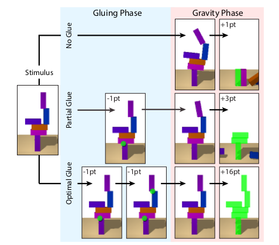

# Relational inductive bias for physical construction in humans and machines

Jessica B. Hamrick, Kelsey R. Allen et al.

[https://arxiv.org/pdf/1806.01203.pdf](https://arxiv.org/pdf/1806.01203.pdf)

## Key takeaways

- The authors introduce an agent that uses object and relation-centric state and policy representation to solve a gluing tower task
- They also show that though this is fundamentally a physical reasoning task, relational reasoning is more important to solve this task. ***"The physical knowledge can be learned, relational knowledge is difficult to come by"***

## Experimental Setting (Humans)

- A tower is constructed from randomly placing blocks on each other, such that every block except the first is stacked on some other block. Then this set was filtered to include only those towers that had one or more blocks moving when gravity was applied. A totlal of 135b unique towers (15 each of 2-10 blocks) was used in the experimental phase

- Took place on a 2D computer screen, participants selecting the blocks they want to glue. Physics was simulated using the Mujuco engine
- Reward formulation -
    - 1 point lost for every joint a glue is applied, or unglued, or glue is applied where it was previously applied as well
    - 1 point gained for every block that didnt move when gravity was applied
    - 10 points if the optimal amount of glue was used
    - 131 - min score possible, 1977 - max possible score

## Results (Humans)

- Subjects tended to work from top to bottom
- Subjects acoided ungluing, mostly because it would cost a point
- Subjects tended to take more time per block for the first action than for subsequent action, may be implying learning of some encoding of the stimulus
- Subjects took more time selecting the first block than the second to glue together, implying predetermining the blocks to glue before selecting

## RL Agent Architecture

- Object and relation centric representation, using a graph network to understand relations
- Graph: Set of nodes N - represents blocks, Set of Edges E - represents sets of blocks, and a global feature G - can be the overall stability of the tower
- Node representation encodes semantic information such as position ($x$) and orientation ($q$) whereas edge representations encode presence of glue or not ($u$)
    - The GN encodes the block properties into distributed node representations - $n_i=enc_n(x_i, q_i ; \theta_{enc_n})$ and the edge properties similarly as $e_{ij} = enc_e(u_{ij}; \theta_{enc_e})$ via a different encoder and the global property $g = 0$ initially
    - The GN then computes functions over nodes (to find out if the nodes are in contact or not) and over edges (to find out the force acting on a block) edge model - $e'_{ij} = f_e(n_i, n_j, e_{ij}, g; \theta_{fe})$, node model -$n'_i = f_n(n_i, \Sigma_j e'_{ij}, g; \theta_{fe})$ and the global model $g' = f_g(g, \Sigma_i n'_i, \Sigma_{ij} e'_{ij} ; \theta_{fg})$
    - Given these updated $e'_{ij}$, this is then decoded into $\pi_{ij} = dec_e(e'_{ij}; \theta_{dec_e})$, which si then considered a probability of a particular action, $\pi_{\sigma}$ denoting the stop action

    

## Experiments and Results

- Supervised learning subtask -
    - The GN was employed to simple supervised tasks - such as inferring the total stability or inferring which edges should be glued. Results imply these tasks can be done satisfactorily by the GN
    - Inferring the total stability - In this case, both a fully connected graph and sparesely connected graph give good results, the sparse graph leading to more efficient learning
    - Inferring which edges should be glued - the authors hypothesized that adding recurrences for message passing would improve the accuracy, and it did as shown

    

- Sequential decision making -
    - 3 models are compared - the MLP (uses only physical/spatial structure to compute the Q values), the GN-fully connected and the GN-sparse (both use relational structures to calculate the Q values, with 3 recurrence steps), and a simulation agent (Having both physical as well as relational modules)
    - Both the MLP and GNFC have are fully connected, hence can select any 2 pairs of blocks, which might not even be adjacent. The relational module in the GNFC leads to 883 points more on average than the MLP
    - The GN further improves performance, 183 points more on average than GNFC. GNFC does not properly utilise the structure (has all connections, so has to determine the valid actions as well, whereas GN only has connections for adjacent blocks), which ends up hurting performance
    - Generalization - To test this, the authors tested another set of agents on a set not containing 7, 10 block towers, and were tested on them. The GN succesfully interpolates and extrapolates to both the 7, 10 block towers, the GNFC successfully interpolates, but isnt able to extrapolate, whereas the MLP fails significantly, not able to sove a single task
    - The simulator agent, performs better than the GN agent by 156 points on average. **The agent is given access to a perfect simulator, which is somewhat unrealistic.**
    - The performance improve between GNFC and MLP ios far greater than the one between Simulated agent and GN, implying learning relational structure is more important than learning the physical structure
    - The Human performance lied between MLP and GNFC. An interesting observation was that the errors of the GN and the humans were very different. Humans made many false positive errors, whereas GN didnt - maybe because of the pereptual uncertainity in humans - leading to overestimating the instability of towers
    - Results of all the models, inluding humans -

    

## Future directions

- The authors tried to incorporate relational reasoning in an RL agent. How about analogical reasoning? This has been previously studied in humans "[Analogical and relational reasoning](https://psycnet.apa.org/record/2012-08871-013)", and have been modelled to be explicitly relational
- GN can be looked into to model human interactions and day planning and such tasks. Though not related to RL, this can be an interesting way forward
